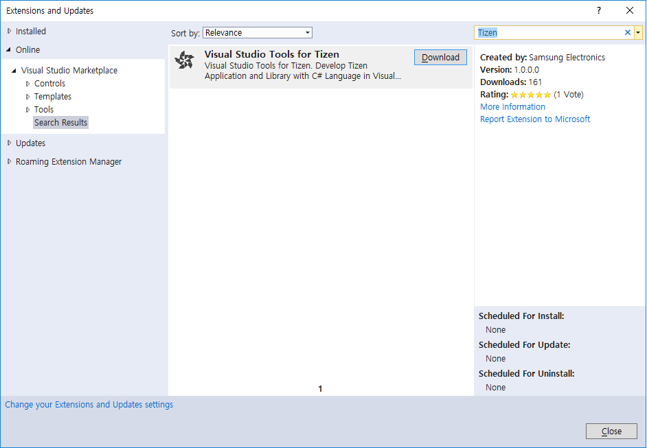
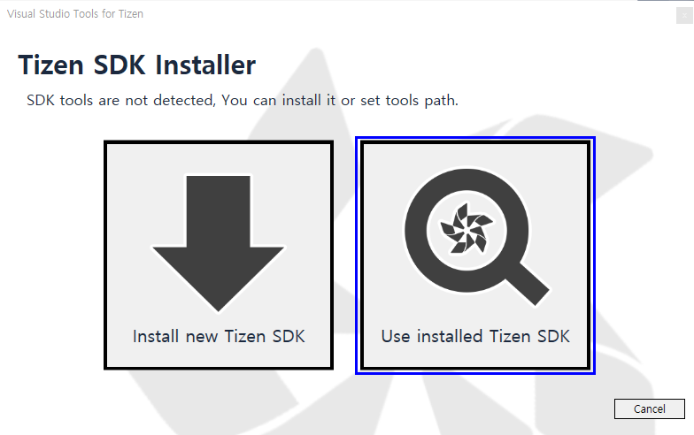
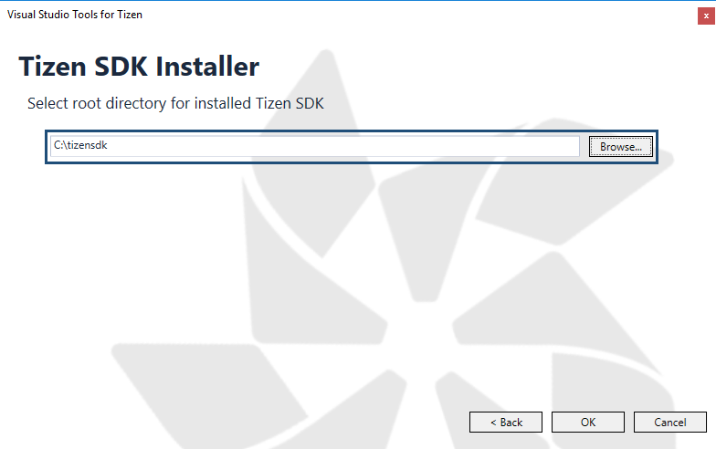
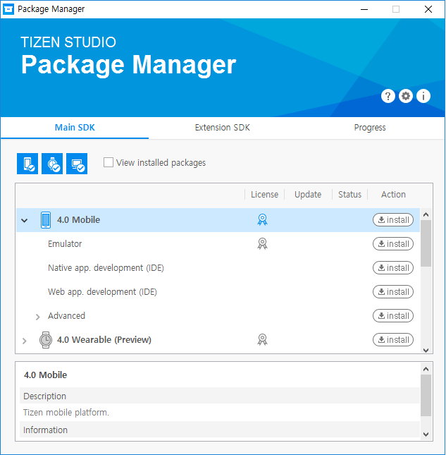
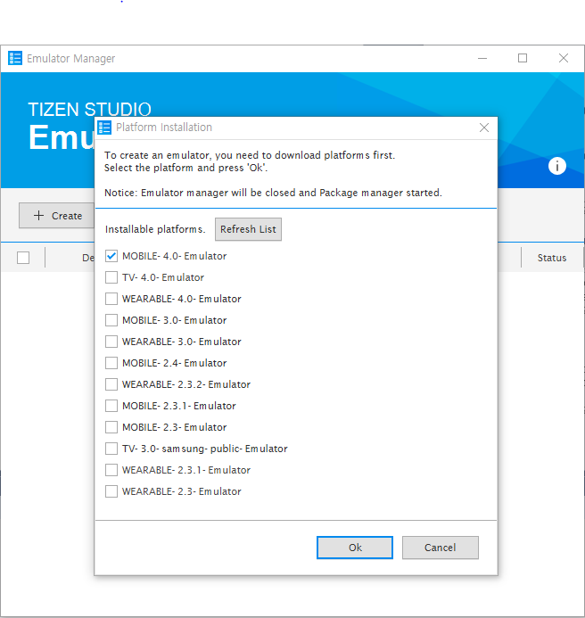

# Installing Visual Studio Tools for Tizen

You need the following components on top of Visual Studio to make Visual Studio Tools for Tizen work:

- VSIX : Visual Studio extension for Tizen packaging
- Tizen Baseline SDK  
The SDK is shared with the Tizen Studio, and it supports tools (such as Certificate Manager, Device Manager, Emulator, SDB, and on-demand rpm) for developing Tizen .NET applications.

## Prerequisites
To work with Visual Studio Tools for Tizen, your computer must have:

- At least 1.5 GB of available disk space
- Visual Studio 2017  
Visual Studio Tools for Tizen works with all Visual Studio variations, including Community. Installing or re-installing Visual Studio with .NET desktop development and .NET Core cross-platform development toolsets is recommended.
- Java Development Kit (JDK) 8  
JDK 8 is needed to use the Tizen Baseline SDK. OpenJDK is not supported.

  Download the JDK 8 from the official [Oracle Web site](http://www.oracle.com/technetwork/java/javase/downloads/index.html). Select the appropriate platform for your hardware architecture and Windows&reg; version. Run the downloaded executable file and follow the displayed instructions.

### Emulator Requirements

Tizen emulator for Visual Studio has the same requirements as the emulator in the Tizen Studio. To check the detailed hardware and software requirements for the Tizen emulator, see [Emulator Requirements](https://developer.tizen.org/development/tizen-studio/download/installing-tizen-studio/prerequisites#emulator).

- Intel&reg; Hardware Acceleration Execution Manager (Intel&reg; HAXM) is required to speed up the Tizen emulation on Intel-VT-enabled systems. Intel&reg; HAXM installation is started automatically as part of the Visual Studio Tools for Tizen installation. For more information, see [Hardware Accelerated Execution Manager](https://developer.tizen.org/development/tizen-studio/download/installing-tizen-studio/hardware-accelerated-execution-manager).
- Make sure Hyper-V is disabled (in Windows&reg; 8 or later):

   1. In the Start menu, select **Programs and Features**.

      

   2. Select **Turn Windows features on or off**.

   3. Disable **Hyper-V** and click **OK**.

      

   4. Reboot the computer.

## Visual Studio Tools for Tizen Installation

 ### Extensions Installation
  Visual Studio Tools for Tizen extension is registerd in Visual Studio Markekplatce. So, You can install extensions from the Visual Studio Marketplace in Visual Studio IDE.  

  1. Click the "Extensions and Updates..." item in Tools menu of Visual Studio IDE.  
  2. Search the "Tizen" in Visual Studio Marketplace.
  3. Click the "Download" button, and close Visual Studio IDE, then will starting install.

  Alternatively, If you want to download and install the VSIX file, then you can donwload in [Visual Studio Marketplate website](https://marketplatce.visualstudio.com/items?itemName-vs-publisher-1484655.VisualStudioToolsforTizen).  

 ### Set up the Tizen Baseline SDK.
  After extensions install, you want to use the Tizen SDK tools, you must set up the Tizen baselind SDK. But, If the Tizen Studio is already installed in your computer, you can just [set the tool path](how-to-install.md#set-up-the-tizen-baseline-sdk-path).

  #### Tizen baseline SDK install  
   Immediately after installing the extension package, you need to install the "Tizen Baseline SDK". If you have already installed it, skit this step.

   1. Click the "Tizen Package Manager" item in Tools > Tizen menu of Visual Studio IDE.  
   2. Click the "Install new Tizen SDK" button.  
   
   3. Read license document and click the "I Agree" button.  
   
   4. Enter the root directory path where you want to install and click the "Next" button.  
   
   5. The Installer will automatically download and install the required packages.  
   
   
   

  #### Set up the Tizen Baseline SDK path  
   If the Tizen Studio or Tizen Baseline SDK is already installed in your computer, you not need to install. Instead, you need to set up a root directory that is already installed. If you have installed the Tizen Baseline SDK through [the above process](how-to-install.md#tizen-beseline-sdk-install), skit this step.  

   1. Click the "Tizen Package Manager" item in Tools > Tizen menu of Visual Studio IDE.
   2. Click the "Use installed Tizen SDK" button.  
   
   3. Enter the root directory of your existing Tizen Studio installation.  
   
     
   **`If the installer gives a warning about your Tizen Studio version being too low, update the Tizen Studio by using the Package Manager after setting the tool path.`**

   Alternatively, you can set up each tool path directly.
   1. Click the "Options" item in Tools menu of Visual Studio IDE.
   2. Click the "Tools" item in the Tizen's sub-list on the left.
   3. Enter a root directory that is already installed in the "Tool Path".
   4. Then, the paths for other tools are automatically set up.  
   

 ### Install Emulator Image
  If you have not real device, you can run the app through the Tizen emulator. To use emulator, download the Tizem emulator image. There are two ways to use the "Tizen Package Manager" or the "Tizen Emulator Manager"  
  **`Tizen Emulator Manager will activates the installation support windows only when no emulator image is installed on your computer.`**
  

  **Using Tizen Package Manager**
   1. Click the "Tizen Package Manager" item in Tools > Tizen menu of Visual Studio IDE.
   2. Select the profile & version you want to install from the list and click the "Install" button.  
   

   **Using Tizen Emulator Manager**
   1. Click the "Tizen Emulator Manager" item in Tools > Tizen menu of Visual Studio IDE.
   2. Select the profile & version you want to install from the list and click the "OK" button.  
   

## Troubleshooting

If you encounter problems with the installation:

- To check whether VSIX is installed correctly:
  - Check the Visual Studio Tools for Tizen properties by selecting **Tools &gt; Extensions and Updates** and searching for "Tizen".

    

- To make sure the baseline Tizen SDK is installed correctly:
  - Check the tool path by selecting **Tools &gt; Options &gt; Tizen &gt; Tools**.

    

- To check whether Tizen Project properties have been copied correctly:
  - Make sure that the `Tizen.NET.ProjectType.props` and `Tizen.NET.ProjectType.targets` files are located in the `C:\Program Files (x86)\Microsoft Visual Studio\2017\Professional\MSBuild\Tizen\VisualStudio` folder.

     
