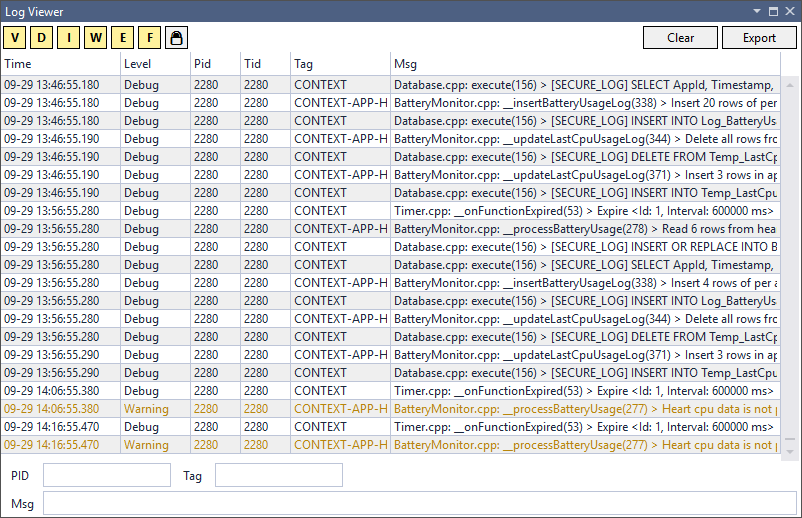
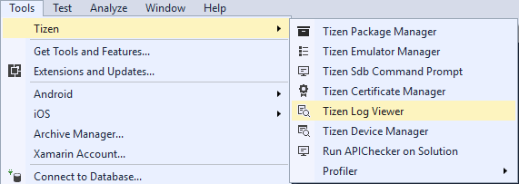

# Log Viewer

The Log Viewer enables you to check your log messages in Visual Studio. It shows the same messages as the **Log View** in the [Device Manager](device-manager.md). However, the Log Viewer can be imported into Visual Studio.

The Log Viewer helps you debug your application by capturing all the events logged by the platform and your application. The Log Viewer shows the logs through the dlog logging service. The service consists of the dlogutil and dlog library. You can also see logs with the `dlogutil` command in the CLI environment, and create log entries with the dlog library.

**Figure: Log Viewer**

The Log Viewer displays a log table consisting of the following fields:

- **Time**: log time
- **Level**: priority level that indicates the urgency of the log message
- **Pid**: process ID
- **Tid**: thread ID
- **Tag**: identification of the log message source
- **Msg**: log message

## Launching the Log Viewer

To launch the Log Viewer, in the Visual Studio menu, go to **Tools &gt; Tizen &gt; Tizen Log Viewer**.

**Figure: Launching the Log Viewer**

## Understanding and Filtering Logs

In the log table, you have the following options and functions:

- Log level filtering option  
  In the Log Viewer, you can filter the log messages using the **V** (verbose), **D** (debug), **I** (info), **W** (warning), **E** (error), and **F** (fatal) buttons to show the log messages matching the selected type.
- Keyword filtering option  
  You can filter the log messages by selecting one of the **PID**, **Tag**, and **Message** options, or entering keywords in the bottom of the Log Viewer. The keywords must be separated by a space.
- Scroll lock  
  The log table shows the latest logs by default. While the application is running, the log table scrolls as new logs are added to the table. To stop the table from scrolling while you are checking a specific log, click the **Scroll Lock** button ().
- Clearing the table  
  You can remove all log messages from the log tab by clicking **Clear**.
- Exporting logs to a file  
  You can export the current log messages in the Log Viewer and save them as a log file by clicking **Export**.